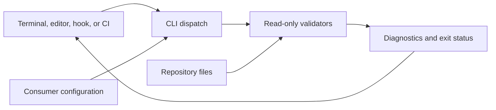

<!--
ARCHITECTURE.md
popo

Copyright © 2026 Dagitali LLC. All rights reserved.

System context, component ownership, execution flow, and trust boundaries.

Maintainer Notes
- Keep claims grounded in repository sources and preserve consumer-owned policy.
- Link to detailed guidance rather than maintaining competing copies.
-->

# Architecture

Popo is a read-only repository-policy CLI. It inspects a consumer-selected directory and reports
findings; the consumer owns its files, policy values, CI integration, and any remediation.

- [System Context](#system-context)
- [Repository Architecture](#repository-architecture)
- [Execution Flow](#execution-flow)
- [Optional Integrations](#optional-integrations)
- [Automation Architecture](#automation-architecture)
- [Trust Boundaries](#trust-boundaries)
- [Change Impact and Sources of Truth](#change-impact-and-sources-of-truth)

## System Context

Editors, terminals, hooks, and CI invoke the same installed `popo` command or `python -m popo` entry
point. Python is the implementation runtime; documentation and automation checks can inspect
projects implemented in other languages. Dependency and Python-policy checks require their
documented Python-specific inputs.

## Repository Architecture

| Component | Source | Responsibility |
| --- | --- | --- |
| Entry points | `src/popo/__main__.py`, `src/popo/cli.py` | Parse commands, select roots, dispatch checks, and return statuses |
| Configuration | `src/popo/config/` | Load consumer settings and domain-specific defaults |
| Validators | `src/popo/checks/` | Inspect files and return findings |
| Shared support | `src/popo/support.py` | Discover automation paths, normalize releases, and report results |
| Package contract | `src/popo/__init__.py`, `src/popo/py.typed` | Version lookup, intentional exports, and typing marker |
| Verification | `tests/` | Unit, CLI integration, distribution, and clean-install contracts |
| Documentation | Root Markdown and `docs/` | Public guidance, examples, runbooks, and historical records |

The [test layout] defines the precise layer boundaries. Package metadata, dependencies, supported
Python versions, and tool configuration belong in `pyproject.toml`.

## Execution Flow

1. Parse a command and its options, including the inspected root.
2. Load the applicable consumer settings from that root's `pyproject.toml`.
3. Inspect supported files and collect diagnostics without rewriting inputs.
4. Report `PASS` or `FAIL` and return the command's documented status.

`check-all` runs the baseline checks and includes automation contracts when their configuration
table is present. Release-changelog validation requires an explicit version and remains separate.
Configuration failures are reported; some I/O and decoding exceptions propagate. The [configuration
reference] and source docstrings describe individual command boundaries.

## Optional Integrations

Consumers can invoke individual checks from their existing hooks or CI and select their own roots
and policy values. Automation contracts join `check-all` only when `[tool.popo.automation]` is
present; standalone invocation remains available without that table. The [adoption playbook]
explains how to evaluate a checker alongside existing controls before replacing them.

Popo's contributor Make targets and hooks describe this repository's development environment.
Consumers need not adopt its branch names, dependency ranges, coverage policy, or release process.

## Automation Architecture

Repository automation separates PR routing, source checks, artifact validation, dependency auditing,
and publication. The [workflow map] owns triggers and job responsibilities; the [release policy]
owns tagged-artifact validation and publication safeguards. A passing consumer check does not
establish that repository automation ran or that hosted rules enforce its result.

## Trust Boundaries

Checks inspect files without executing referenced automation or fetching remote code. This does not
make Popo a general filesystem sandbox or a complete parser for every format. Consumers choose the
checkout, execution environment, permissions, and policy. See the [security policy] for limitations.

Source checks, artifact validation, and external publication are separate activities. The [workflow
map] describes the configured automation; the [release policy] owns publication safeguards.

## Change Impact and Sources of Truth

Trace changes from CLI/configuration to validators, tests, and maintained documentation. Use the
[change-impact map] to identify affected surfaces and [design guidance] to assess compatibility.
Current source and tests establish behavior; historical notes preserve the evidence for their
specific versions.

[workflow map]: CI-CD-WORKFLOWS.md
[release policy]: CONTRIBUTING.md#release-policy
[design guidance]: DESIGN.md
[security policy]: SECURITY.md
[configuration reference]: docs/CONFIGURATION.md
[change-impact map]: docs/architecture/change-impact-map.md
[adoption playbook]: docs/playbooks/adopt-popo.md
[test layout]: tests/README.md
